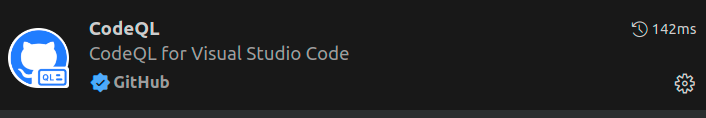
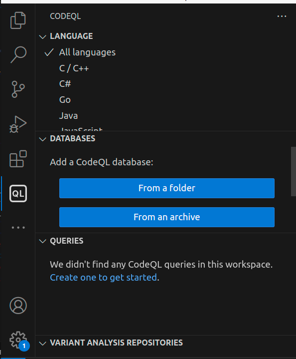
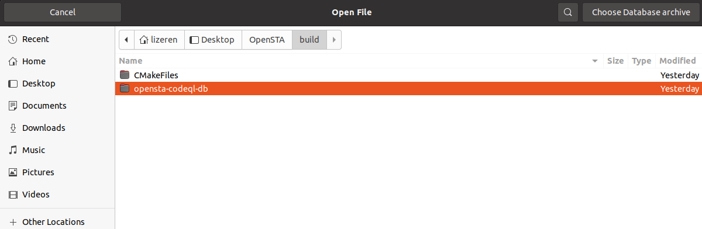

  

# How to Use CodeQL

  

## Install CodeQL CLI

  

1. Download the `codeql-linux64.zip` file from [GitHub's CodeQL CLI releases](https://github.com/github/codeql-cli-binaries/releases).

2. Add the executable (shell script) to your `PATH`:

```bash

vim ~/.bashrc

export  PATH="/home/lizeren/Downloads/codeql/codeql:$PATH"

source ~/.bashrc

```

3. Verify the installation by checking the version. You should see an output message displaying the version number:

```bash

codeql --version

```

  
  
  

## Generate a Dynamic Link Library

  

To analyze OpenSTA with CodeQL, we will first build it into a CodeQL database. You can refer to the official guide: [Preparing Your Code for CodeQL Analysis](https://docs.github.com/en/code-security/codeql-cli/using-the-codeql-cli/creating-codeql-databases).

  

### Step 1: Build the Project

  

Before starting the database creation process, I recommend completing the regular build process first. For most compiled languages, CodeQL requires invoking the build system to generate a database, so the build method must be compatible with the CLI.

  

Follow the build instructions for OpenSTA [here](https://github.com/The-OpenROAD-Project/OpenSTA). Most prerequisites can be installed using `apt-get` on Ubuntu, except for [CUDD](https://github.com/ivmai/cudd), which needs to be installed separately.

  

Once all dependencies are resolved, build the OpenSTA binary as follows:

  

```bash

git  clone  https://github.com/parallaxsw/OpenSTA.git

cd  OpenSTA

mkdir  build

cd  build

cmake  -DCUDD_DIR=<CUDD_INSTALL_DIR>  ..

make

```

  

### Step 2: Generate the CodeQL Database

  

Navigate to the `build` directory, where the `MakeFiles` are located, and run the following command to generate the CodeQL database:

  

```bash
make clean
codeql  database  create  opensta-codeql-db  --overwrite  --language=cpp  --command="make"

```

  

This will create a folder named `opensta-codeql-db`.

if you didn't make clean, you would see the error message like this.
```bash
Initializing database at /home/lizeren/Desktop/codebase_codeql/zlib/libz-codeql-db.
Running build command: [make]
Running command in /home/lizeren/Desktop/codebase_codeql/zlib: [make]
[2024-12-12 17:26:52] [build-stdout] make: Nothing to be done for 'all'.
Finalizing database at /home/lizeren/Desktop/codebase_codeql/zlib/libz-codeql-db.
CodeQL detected code written in C/C++ but could not process any of it. For more information, review our troubleshooting guide at https://gh.io/troubleshooting-code-scanning/no-source-code-seen-during-build.

```

  

## Use CodeQL in VS code

Install CodeQL extension in VS code



We also need a starter workspace to use with the CodeQL in VS code

[vscode-codeql-starter](https://github.com/github/vscode-codeql-starter/tree/main#vscode-codeql-starter)]

1. Clone this repository to your computer.

- Make sure to include the submodules, either by `git clone --recursive` or by `git submodule update --init --remote` after clone.

- Use `git submodule update --remote` regularly to keep the submodules up to date.

2. In VS Code, click File > Open Workspace. Select the file `vscode-codeql-starter.code-workspace` in your checkout of this repository.

3. Click 

4. Select 