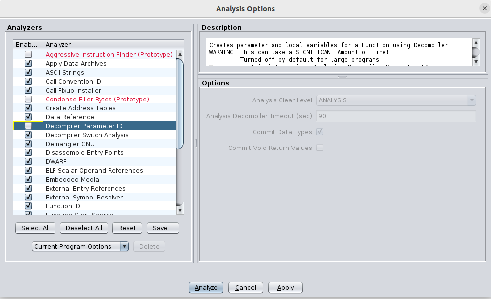
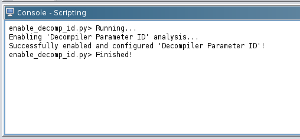
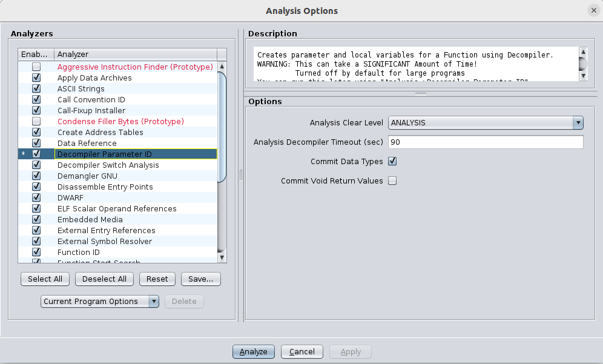
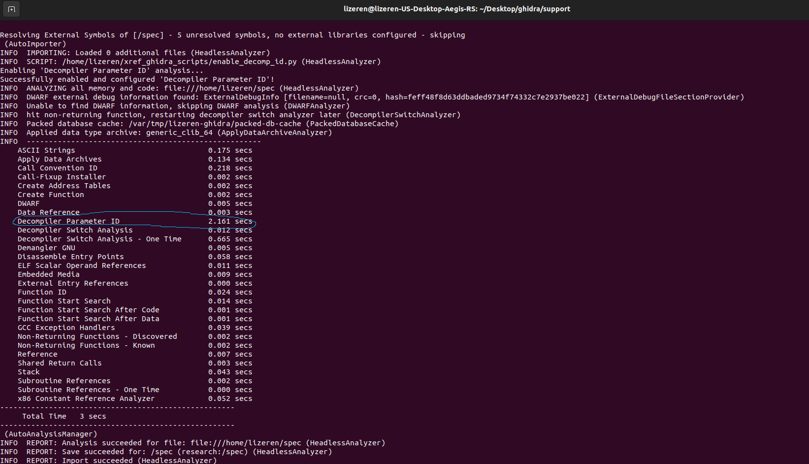

How to set Ghidra Analyzer Option in Headless mode

### Intuition

I am lucky to find this [GetAndSetAnalysisOptionsScript.java](https://github.com/NationalSecurityAgency/ghidra/blob/master/Ghidra/Features/Base/ghidra_scripts/GetAndSetAnalysisOptionsScript.java)
which shows examples of how to get, set, and reset analysis options using the GhidraScript API.
Specifically, I am interested in setting `Decompiler Parameter ID` analyzer option.

```java
private void setSomeOptions() {

  Map<String, String> optionsToSet = new HashMap<String, String>();

  optionsToSet.put("PDB.Symbol Repository Path", "/tmp/symbols");
  optionsToSet.put("ASCII Strings.Minimum string length", "LEN_10");
  optionsToSet.put("Decompiler Parameter ID.Prototype Evaluation", "__thiscall");
  optionsToSet.put("Decompiler Parameter ID", "true");
  optionsToSet.put("Decompiler Parameter ID.Analysis Decompiler Timeout (sec)", "90");

  // Set some options by passing in a Map of options to set
  setAnalysisOptions(currentProgram, optionsToSet);

  // Set one specific option individually (pass in option name and value) 
  setAnalysisOption(currentProgram, "Stack", "false");
}
```
### What does Decompiler Parameter ID do?

The **Decompiler Parameter ID Analyzer** (`Analysis → One Shot → Decompiler Parameter ID`) uses the decompiler and an exploration of the call tree to determine **parameter**, **return type**, and **calling convention** information about functions in a program.

This analyzer can be quite useful when you have **rich type information**, such as known types from **library calls**. However, if you run this analyzer **too early** or before fixing problems, you may end up propagating **incorrect information** throughout the program.

### How should we write a dedicated script to set the `Decompiler Parameter ID` analyzer option?

I am a consistent python user, so here is the python version called __enable_decomp_id.py__
```python
# Enables "Decompiler Parameter ID" analysis and configures its settings.
#
# @category xref.Demo
#

from ghidra.app.script import GhidraScript

class EnableDecompilerParameterID(GhidraScript):
    def run(self):
        if currentProgram is None:
            print("No program is open! Aborting.")
            return

        print("Enabling 'Decompiler Parameter ID' analysis...")

        # Define the settings for "Decompiler Parameter ID"
        options_to_set = {
            "Decompiler Parameter ID": "true",  # Enable the analysis
            "Decompiler Parameter ID.Prototype Evaluation": "__thiscall",  # Example setting
            "Decompiler Parameter ID.Analysis Decompiler Timeout (sec)": "90",  # Set timeout
        }

        # Apply the settings
        setAnalysisOptions(currentProgram, options_to_set)

        print("Successfully enabled and configured 'Decompiler Parameter ID'!")

# Allow execution when running as a script (Optional, useful for debugging)
if __name__ == "__main__":
    script = EnableDecompilerParameterID()
    script.run()
```

### How to verify the script works?
The easiest way is to run the script in Ghidra's GUI.
Currently If we import the target binary into Ghidra, the `Decompiler Parameter ID` analyzer option is not enabled.


After running the script, we can see the `Decompiler Parameter ID` analyzer option is enabled.




### So what's the command to run the script in headless mode?
```bash
./analyzeHeadless /home/lizeren research -scriptPath /home/lizeren/xref_ghidra_scripts -import /home/lizeren/spec -preScript enable_decomp_id.py
```
Explanation to the command:
- `/home/lizeren`: The path to the directory containing the Ghidra project.
- `research`: The name of the Ghidra project.
- `-scriptPath`: The path to the directory containing the script.
- `-import`: The path to the target binary.
- `-preScript`: The path to the script to run before the analysis.
Notes:
- The `-import` option is optional, it is used to import the target binary into Ghidra. So here we assume the target binary is never imported into Ghidra before.

After running the command, we can see the output:


This time when you go to Ghidra GUI and analyze the target binary again using `Decompiler Parameter ID` analyzer option, the process will be much faster.